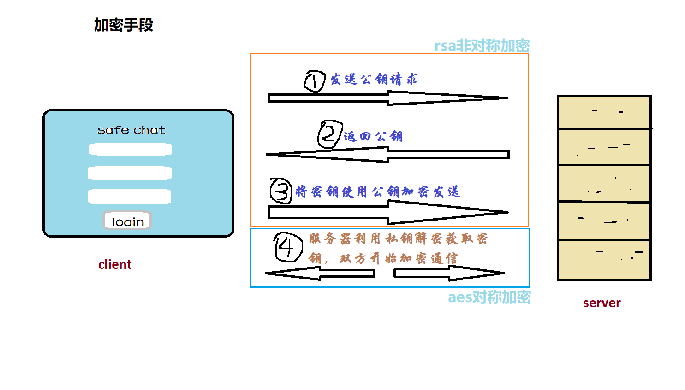

# safe chat
 
### 项目用于学习研究，请勿用于非法用途
---
**一款加密消息聊天程序，保障安全**

## 使用教程🔎
客户端：下载release打开即可  
服务器：服务器端代码在server文件夹下，运行server.py即可  

## 注意事项🧨
**AES密钥必须为16位整数，输入$代表随机生成**  
**本项目未对中间人攻击和社会工程学攻击设计防范，对于绝密场景谨慎使用**  